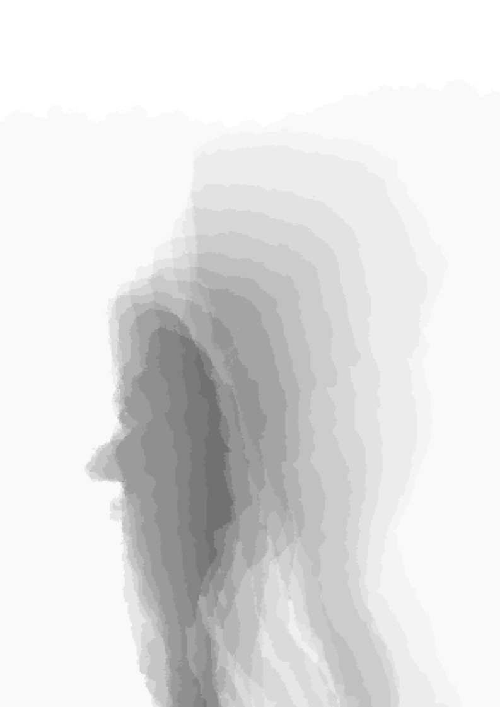
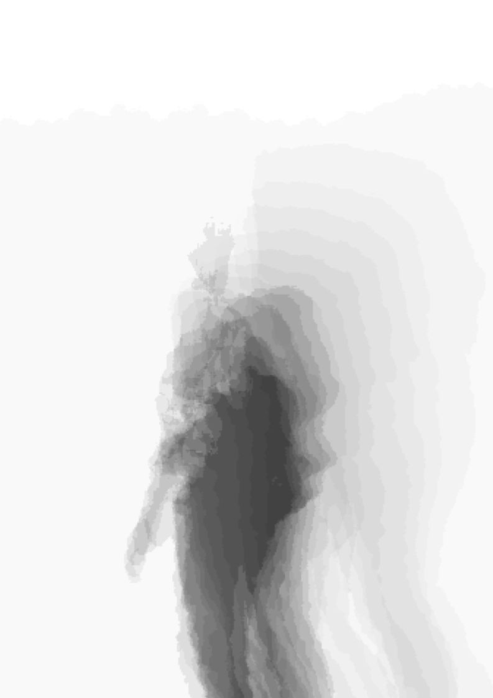
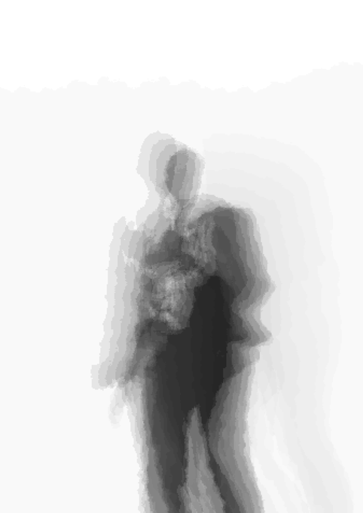

# wandering_souls
Using Kinect &amp; Processing to build a projected wandering soul shadow animation of the person in front of the device. 

As you walk in front of the wall, you see your shadow on it. When you come closer your shadow starts to wander around, walking left and right aimlessly till it walks off the projected area.

Art & Engineering <3

